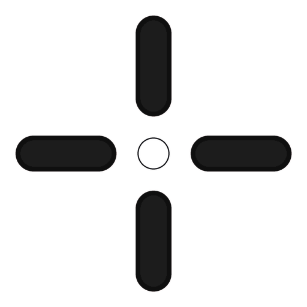
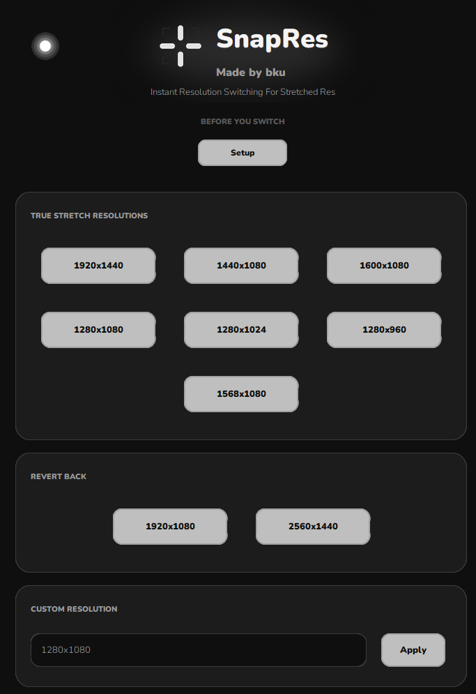
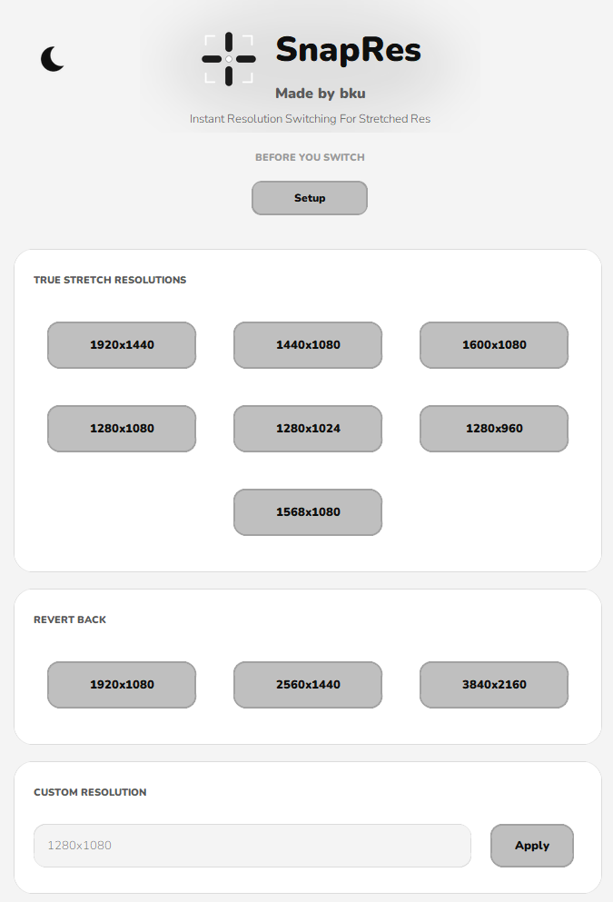

<picture>
  <source media="(prefers-color-scheme: dark)" srcset="assets/logo_dark.png">
  <source media="(prefers-color-scheme: light)" srcset="assets/logo_main.png">
  
</picture>

# SnapRes

**Instant resolution switching for stretched res.**

SnapRes is a one-click resolution switcher built for Valorant players who run stretched res. Pick a resolution, it applies instantly, done. No digging through Windows display settings mid-session.

| Dark Mode | Light Mode |
|---|---|
|  |  |

---

## What it does

Stretched res players know the drill: alt-tab out, open Windows display settings, type in the same handful of numbers you always use, wait for it to apply, alt-tab back in, then undo the whole thing after the match. SnapRes turns that into one click.

- Switch between common true stretch resolutions (1920x1440, 1440x1080, 1600x1080, 1280x1080, 1280x1024, 1280x960)
- Revert back to native res (1920x1080, 2560x1440) just as fast
- Enter any custom resolution of your own if the presets don't cover it, and save it as a profile so it's one click away next time
- Light mode / dark mode
- No account, no ads, no background process running when you're not using it

## Before you switch

Stretched res doesn't work out of the box, a few things need to be set up first for it to actually apply in-game. SnapRes has a built-in "Setup" guide for this, but here's the short version:

1. **Disable your other monitor(s).** If you run multiple monitors, open Device Manager > Monitors and disable every monitor except your main one. Skip this if you only have a single display.
2. **Add every resolution as a custom resolution in your GPU driver.** Windows can only switch to a resolution your GPU driver already knows about, SnapRes can't invent new ones on the fly. Open your graphics control panel (NVIDIA Control Panel > Display > Change Resolution > Customize > Create Custom Resolution, AMD Software > Display > Custom Resolutions > Create New, or Intel Graphics Software > Display > Custom Resolutions) and manually add each stretched resolution you plan to use. Once it's registered there, SnapRes can switch to it instantly.
3. **Set your GPU scaling to Full Screen.** In the same control panel, find the scaling setting and set it to Full Screen, not Aspect Ratio, not Centered. This makes sure the stretched resolution fills the whole monitor instead of leaving black bars or a small centered image.
4. **Set Valorant to windowed fullscreen + Fill.** In Valorant's video settings: Display Mode > Windowed Fullscreen, and Aspect Ratio Method > Fill. Both need to be set for the stretch to actually apply correctly.
5. **Only switch once you're in a match.** Stretched resolutions only work while you're fully loaded into a game. Using SnapRes at the main menu, agent select, or the item shop will just glitch out, so wait until you're actually in-game first. You don't need to keep SnapRes open after that either. Once the resolution is applied in-game, you can close the app.

## Why I made it

I got sick of doing this manually every single match. Multiply the alt-tab-settings-type-wait-undo cycle by every game in a session and it's just annoying for no reason. So I built something to skip all of that.

## Why it's worth using

It's one click instead of a whole process. There's no account to make, nothing running in the background when you're not using it, and it doesn't try to be anything more than the one thing it's supposed to do. If stretched res is part of your setup, this saves you the hassle every game.

## Download

Grab the latest `.exe` from the [Releases page](../../releases). No installation needed, just run it.

> SnapRes is unsigned, so Windows SmartScreen may flag it on first launch. Click "More info," then "Run anyway." This is normal for small independent tools that don't pay for a code-signing certificate.

## Building from source

If you'd rather run it from source or build the exe yourself:

```bash
git clone https://github.com/bkuwu/SnapRes.git
cd SnapRes
pip install -r requirements.txt
python SnapRes.py
```

To build your own `.exe` with PyInstaller:

```bash
pip install pyinstaller
pyinstaller SnapRes.spec
```

The built exe will show up in `dist/`.

## Open source

SnapRes is fully open source, the complete source code (`SnapRes.py`) is in this repo. Feel free to read through it, fork it, modify it, or use it as a base for your own tool. Pull requests and issues are welcome.

If you use this project to build something else, please credit me, and reach out and show me what you made. I genuinely like seeing what people do with it. You can find me here:

- GitHub: [@bkuwu](https://github.com/bkuwu)
- YouTube: [@bkuuuuu](https://www.youtube.com/@bkuuuuu)

## License

[MIT](LICENSE). Do whatever you want with it, just don't hold me responsible if something breaks.

## Support

SnapRes is free and always will be. If it saved you some time and you feel like tossing a couple bucks my way, my PayPal email is below. Never expected, always appreciated.

**saywhatevl@Gmail.com**

---

Made by [bkuwu](https://github.com/bkuwu)
